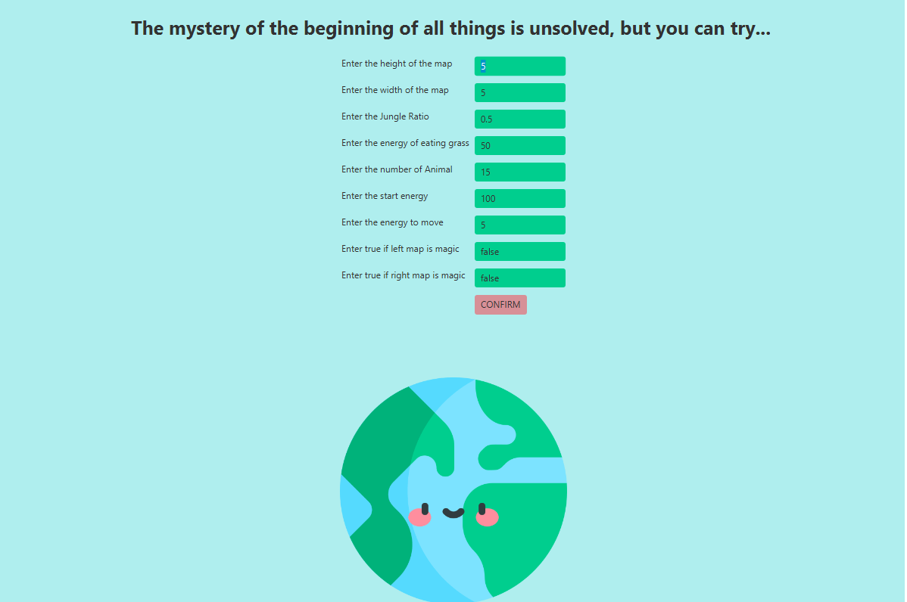
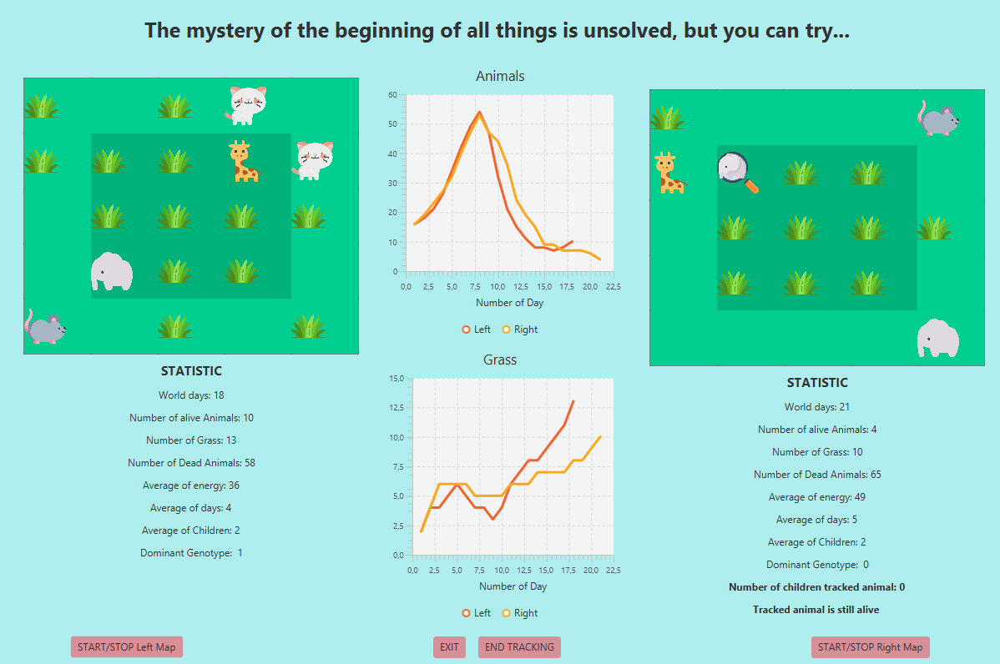
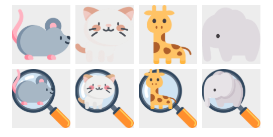

# The evolution of the world 

This simulation shows what is happening with the world during the evolution.
Animals try to survive by eating grass and reproducing. Behavior of animals depends on genes. You can observe this process on charts and statistics for each map.
What is more, you can also indicate the animal whose positions and history you want to know. When the simulation is finished, you can find statistic saved in the files.

## Enter Data

You can enter the start parameters for the simulation yourself.

Good to know - The magic map will add five new animals if there are 5 animals left.

## How to use?

- You can stop simulations of right or left map by pressing the button `START/STOP`
- While the simulation doesn't run, you can click on the animal to track it and see genotype
- You can end anmial tracking by pressing the button `END TRACKING`
- By pressing the button `EXIT` you will exit the application
- Statistics of the right map are marked in yellow on the chart, left map in orange.

## How to recognize animals?

- Elephant has more than 75% start energy
- Giraffe has 50-75% start energy
- Cat has 25-50% start energy
- Mouse has 0-25% start energy

The animal that is being tracked is under a magnifying glass.

## Create your world and have fun! :sparkles:
